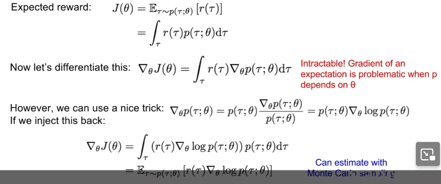
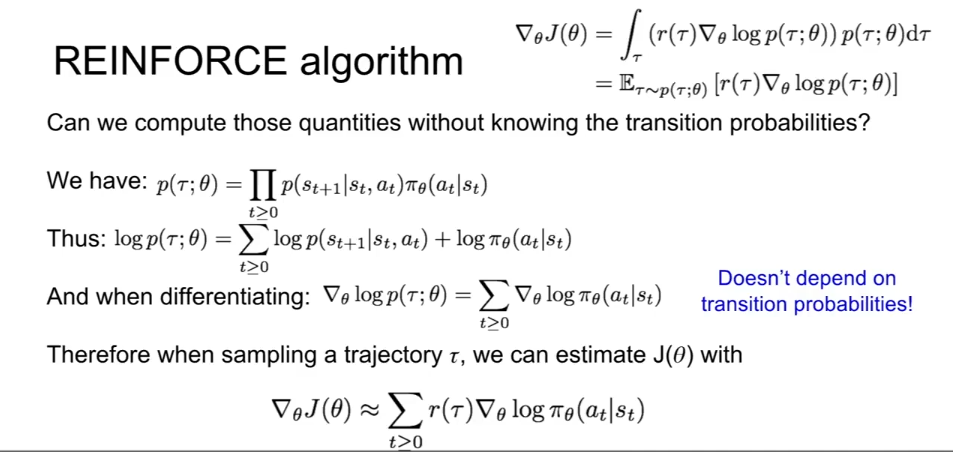

# reinforcement learning(RL)

## what is ~
- agent interacting with environment which provides reward
- goal: learn how to take actions to maximize reward
- environment: State $s_t$, agent: Action $a_t$, environment: Reward $r_t$, Next State $s_{t+1}$
- examples: car-pole problem, robot locomotion, Atari games, Go

## Markov Decision Process(MDP)
- mathematical formulation
- meet **Markov property**: current state completely characterises the state of the world
- define $(\mathcal{S,A,R,}\mathbb{P,}\gamma)$
    - $R$ is distribution of reward (S,A)
    - $P$ is transition probability, distribution of next state (S,A)
    - $\gamma$ is discount factor(upcoming is better than later on)
- process
    - $t=0$, samples initial $s_0\sim p(s_0)$
    - loop: get $a_t\sim \pi(.|s_t)$, samples reward $r_t\sim R(.|s_t,a_t)$, next state $s_{t+1}\sim P(.|s_t,a_t)$
- policy
    - determinstic $\mu$, stochastic $\pi$
    - function map $S\to A$, objective is to find $\pi ^*$ to maximize expected cumulative discounted reward $\mathbb{E}\left [ \sum_{t\ge 0}\gamma ^tr_t\right ]$
- value function
    - using expected cumulative reward from this time to judge how much good / bad of given policy
    - state: $V^{\pi}(s)$
    - state-action pair: $Q^{\pi}(s,a)$

## Q-Learning
- Q table: memorize $S\times A$ to judge
- Q function: Bellman equation: get optimal $Q^*(s,a)=E[r+\gamma \max_{a'}Q^*(s',a')|s,a]$ ($s'$ means next state)
- solving: value iteration $Q_{i+1}=E[...Q_{i}...]$(get rid of $*$) till $i\to \infty$. problem: not scalable, must compute each state-action pair.
- solution: Deep Q Network to approximate $Q(s,a)$
- experience replay
    - problem
        1. samples are correlated lead to inefficient learning.
        2. Current network determines next training samples.
    - solution: (control replay)
        1. update **replay memory** table of transitions $(s_t,a_t,r_t,s_{t+1})$
        2. train network on **random** minibatches from table(still has replay).
- challenge: initialize action: with small probability use random action(exploration) / otherwise greedy(epsilon) action(exploitation利用)
- episode means epoch

## Deep Q Network
- $Q(s,a;\theta )\approx Q^*(s,a)$, using network instead of table
- loss function: $L_i(\theta _i)=E[(y_i-Q(s,a,\theta _i))^2]$, $y_i=E[r+\gamma \max Q(s',a';\theta _{i-1})|s,a]$ is target value
- Deep Q Network
    - architecture: $s_t:84\times 84\times 4$ stack of last 4 frames(RGB -> grayscale, downsampling, cropping) -> CONV -> FC-256 -> FC-4(4-D Q-values for 4 actions)
    - efficient: single forward pass computes all Q-value for actions from current state

## policy gradients
- Q-function is quite complicated for continuous, high-dimension state
- find a policy from collection of policies rather than $(s,a)$
- $\prod =\left \{ \pi _{\theta},\theta \in \mathbb{R} ^m \right \}$, value function $J(\theta)=E[\sum_{t\ge 0}\gamma ^tr_t|\pi _{\theta}]$ so $\theta ^*=\arg \max_{\theta} J(\theta)$

### REINFORCE algorithm
- $J(\theta)=E[r(\tau)]=\int_{\tau}r(\tau)p(\tau;\theta)d\tau$, **sampling** trajectory(轨迹) $\tau=(s_0,a_0,r_0,s_1,\dots)$
    - gradient ascent: $p(\tau;\theta)$ is intractable, so using $\log$ to estimate
    - 
    - 
- gradient estimator $\nabla _{\theta}J(\theta)$
    - problem (stuck in local optimal, but still good enough):
        - good trajectory means good action probability. But in expaction(sum up), it averages out.
        - suffer from high variance, because credict assignment is hard.
    - Variance reduction: substitude $r(\tau)$
        1. first idea: push up probability of an action by futrue of that state $\sum_{t'\ge t}r^{t'}$
        2. discount factor to ignore far away $\sum_{t'\ge t}\gamma ^{t'-t}r_{t'}$
        3. baseline: ohter actions are better or worse than expect
            - simple baseline: moving average of past reward $\sum_{t'\ge t}\gamma ^{t'-t}r_{t'}-b(s_t)$
            - better baseline: push up action probability if $Q^{\pi _{\theta}}(s_t,a_t)-V^{\pi _{\theta}}(s_t)$ is large($V^{\pi}$ means average value)
- application: Recurrent Attention Model(RAM)
    - image classification, take a sequence of glimpse on different region, inspired by human perception, eye movement
    - saves computational resources; has better performance, ignore irrevalent parts
    - good at high-revolution images, image captioning, visual question-answering
    - state: glimpse; action: region; reward: classification at final step
    - use RNN to model policy

### Actor-Critic Algorithm
- actor $\theta$: policy; critic $\phi$: Q-function
- critic only learn $(s,a)$ from policy, can use Q-Learning tricks(like experience replay)
- advantage function: how much better than average $A^{\pi}(s,a)=Q^{\pi}(s,a)-V^{\pi}(s)$
- update: `for i=1..m: for t=1..T`: $\Delta \theta=\Delta \theta+A_t\nabla _{\theta}\log(a_t^i |s_t^i),\Delta \phi=\sum_i \sum_t \nabla _{\phi}||A_t^i||^2$

### AlphaGo
- mix of supervised learning, RL; mix Monte Carlo Tree Search, Deep RL.
- featurize the board
- use supervised trained network to initialize policy network
- using policy gradient by playing with itself
- has actor-critic
- combine policy and value network in Monte Carlo Tree Search and select action by lookahead

