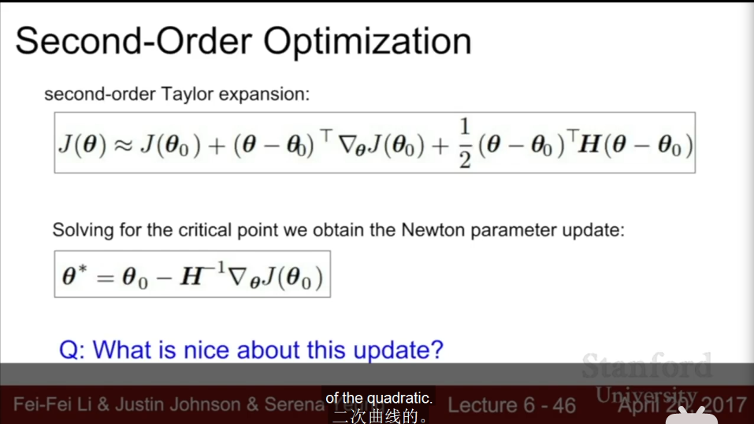

# training neural network II

## fancier optimization
- problems:
    - loss changes quickly in one direction but slowly in another. SGD may jitter along steep direction, especially in high dimension.
    - local minimum, saddle point is much more common in high dimension
    - small gradient but long way to reach optimial results
    - SGD means minibatches may have noise, takes a long time.
- SGD+Momentum
    - compute $v_{t+1}$ first, then $x_{t+1}$
    - $v_{t+1}=\rho v_t+\nabla f(x_t),x_{t+1}=x_t-\alpha v_{t+1}$
    - $\rho$ means friction, =0.9 or 0.99
- Nesterov Momentum: velocity plus gradient of origin plus velocity(rather than origin point), trying to fix potential error that velocity may make.
    - $v_{t+1}=\rho v_t+\alpha \nabla f(x_t+\rho v_t),x_{t+1}=x_t+v_{t+1}$
    - prefer terms $x_t,\nabla f(x_t)$, rearrange: $\tilde{x}_t=x_t+\rho v_t$, $v_{t+1}=\rho v_t-\alpha \nabla f(\tilde{x_t})$, $\tilde{x}_{t+1}=\tilde{x}_t-\rho v_t+(1+\rho)v_{t+1}=\tilde{x}_t+v_{t+1}+\rho(v_{t+1}-v_t)$ has terms of gap between previous and current velocity.
- AdaGrad: dimension-wise accelerate/slow down to avoid too slow/fast: grad_squared $gs_{t+1}=gs_t+(\nabla f(x))^2,x_{t+1}=(x_t-\alpha \nabla f(x_t))/(\sqrt{gs}+1e-7)$
    - lower steps as time grows, convenient for convergence in convex function, but problematic for not convex function(stuck in local minimal).
    - tend not to use in practice
    - `1e-7` makes sure not divided by 0.
- RMSProp: from AdaGrad overcome issue of stuck in local minal(monotonic), grad_squared $gs=dr*gs+(1-dr)*(\nabla f(x))^2$, dr=decay_rate=0.9 or 0.99
- Adam(almost): like RMSProp with momentum:  
    `first_moment=beta1*first_moment+(1-beta1)*dx`;  
    `second_moment=beta2*second_moment+(1-beta2)*dx^2`;  
    `x-=learning_rate*first_moment/(sqrt(second_moment)+1e-7)`
    - $\beta$ is like 0.9 or 0.99, so for first step second_moment can be quite small, the first step can be huge.
- Adam(full): bias correction for initial huge step issue.
    `first_unbias=first_moment/(1-beta1**t)`  
    `second_unbias=second_moment/(1-beta2**t)`  
    then substitude momentum with unbias in $x$.
    - in practice paremeters: $\beta_1=0.9,\beta_2=0.999,\alpha=$ 1e-3 or 5e-4. Great start for many models.
- issue: rotated that steep direction doesn't match the coordinate axis.
- learning rate decay:
    1. step decay: decay by half every few epochs
    2. exponential decay: $\alpha=\alpha_0e^{-kt}$
    3. 1/t decay: $\alpha=\alpha_0/(1+kt)$
    - loss function drop suddenly: step decay
    - more critical with SGD+Momentum, less common with Adam
    - This is second-order: concern later, not first.
- second-order optimization: second-order Taylor expansion, computes Hessian matrix(second-order derivative), Netwon method.
    - 
    - No learning rate(directly search the minimum of parabola) in vanilla version
    - Hessian matrix takes O(N^2), inverse takes O(N^3), expensive when N~millions. overcomes:
        1. Quasi-Netwon methods(BFGS准牛顿算法): approximate Hessian matrix with rank 1 updates
        2. L-BFGS(limited memory BFGS), doesn't well in mini-batch

## model ensembles
- train multiple independent models, at test time average their results, avoid overfitting impacts. Has a couple percent enhancement. tips and tricks:
- use multiple snapshots of a single medel instead of model ensembles
- Polyak averaging: one model, using moving averaging(from all epochs) parameter vector in test time.

## regularization
- small scale of data makes complicated model overfixed.
- in practice, use when necessary.
- L2, L1, elastic net(L2+L1) $R(W)=\sum_k\sum_l \beta W^2_{k,l}+|W_{k,l}|$
- common pattern: put stochastic noise to training data, then average out in test time.
- Dropout: randomly set some neurons in each forward pass to zero(recover at next epoch). Probability is hyperparameter: 0.5
    - Used in fully-connected layers or convolution layers and delete some channel dimensions.
    - reason: force redundant representation, prevent co-adaptation of features(need features be independent)
    - another interpretation: training a large ensemble of models that share parameters. Each binary(exist or not) mask is one model.
    - test time: see dropout as random mask on input, thus output is random. Want to average out the randomness: integration $y=f(x)=E_z[f(x,z)]=\int p(z)f(x,z)dz$
        - hard, need approximation: multiply test time results by dropout probability
        - inverted dropout: test cost unchanged, put computation to training stage(divided by $p$)
        - longer training time(only fix gradient on partial neurons)
- batch normalization has the same effect in regularization. But dropout has hyperparameter $p$ that is controllable.
- data augmentation: random crops and scales(and flips, color jitter in contrast and brightness, PCA in RGB pixels, color offsets in all pixels) in images when training.
- DropConnect: cut weight matrix rather than neurons
- fractional max pooling: stochastic pooling area scale
- Stochastic Depth: eliminate some layers

## transfer learning(迁移学习)
- very similar dataset:
    - small dataset by choose subset of classes, reinitialize final FC layer and train while freeze other layers.
    - for bigger dataset, train more layers(but still few) at top/last stage and freeze others. Using lower learning rate to tune the performance(like 1/10)
- very different dataset:
    - small dataset: in trouble, need creative changes to train linear classifier.
    - big dataset: finetune a large number of layers(lager than similar dataset)
- very pervasive: pretraining CNN in ImageNet and then finetuning. model-zoo(tools)
