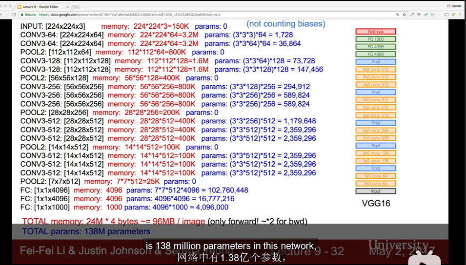

# CNN Architectures

## AlexNet-2012
- 8 layers including normalization
- input: 227\*227\*3
- first layer: CONV1, 96 11\*11 filters, stride 4
    - output volume: $(227-11)/4+1=55$, 55\*55\*96
    - parameters: 11\*11\*3\*96=35K
- second layer: POOL1, 3\*3 filters, stride 2
    - output volume: $(55-3)/2+1=27$, 27\*27\*96
    - parameters: 0
- 60 million params, nearly half(38M) in first FC!
- history note: use tow GPUs because each GPU has 3GB memory, so split neurons to two parts.

## VGGNet-2014
- smaller filters, deeper networks
    - has same **effective receptive field** as 7\*7 CONV by adding more layers
    - first layer has 3\*3, second layer has 5\*5 to first layer due to padding, third layer has 7\*7 to first layer due to padding
    - while deeper means more nonlinearity and fewer parameters($3*3^2*C^2\ vs.\ 7^2*C^2$, C channels in each layer)
- 16/19 layers, only 3\*3 CONV stride 1, pad 1, 2\*2 MAX POOL stride 2.
- no local normalization response
- most memory in early CONV, most params are in late FC. 
- 

## GoogLeNet-2014 winner
- 22 layers, efficient Inception module, no FC layers, only 5 million parameters.
- inception module: local network topology, stack them on top of each other.
    - parallel filter operations
    - CONV(1\*1,3\*3,5\*5), POOL(3\*3), using padding to keep dimension
    - problem: computational complexity, depth blow up and continues to grow
    - solution: "bottleneck" layers using 1\*1 CONV to reduce feature depth. Before 3\*3 5\*5 CONV, after 3\*3 POOL(doesn't break much, thanks to nonlinearity and combination of depth)
- stem: some CONV-POOL
- final: classifier output(no expensive FC layers)
- auxiliary classification outputs in intermediate layers: inject additional gradient at lower layers, which is helpful in DEEP network.(AvgPool-1\*1CONV-FC-FC-Softmax)

## ResNet-2015 winner
- 152 layers with residual connections
- simply stack to make plain CNN deep is not helpful, and not caused by overfitting.
    - reason: hard to optimize deep network.
    - solution: copy learned shallow layers, then add additional layers to identity mapping
    - residual $H(x)=F(x)+x$ instead of identity $H(x)=F(x)$, where $F(x)$ is transformation(CONV)(residual), $H(x)$ is output.
- residual block: x -> 3\*3 CONV -> ReLU(F(x)) -> 3\*3 CONV -> H(x)=F(x)+x -> ReLU
- nice property
    1. if all weights set 0, it works as identity rather than kill, so you can freely set blocks.
    2. gradient flow is easy due to addition gate, and easy for convergence.
- periodically double #filters and downsample(AvgPool) spatially stride 2 (each dimension /2)
- CONV at beginning
- no FC layers(only one 1000 classes FC to output)
- deep(50+) layers use bottleneck layers
- training: batch normalization, Xavier, SGD+Momentum, learning rate divide by 10 when validation error plateaus, no dropout.

## comparision
- AlexNet: low accuracy(small compute), memory heavy
- VGG: highest memory, most operations
- GoogLeNet: highest efficiency
- ResNet: moderate efficiency, highest accuracy

# other architecture
- trend: most deep layers, design of layers, improve gradients flow, deepth vs. width, residual connections.
- Network in Network(NiN)-2014
    - Mlpconv layer with "micronetwork" in each CONV layer dealing with more abstract features, using multilayer perception(1\*1 CONV)
    - introduce bottleneck layers, inspiration of GoogLeNet
- improved ResNet: identity mapping
    - create more direct path for identity mapping throught network
- wide Resudual Networks
    - wider residual blocks(F filters -> F\*k in each layer), reduce depth(~50)
    - more parallel computing lead to efficiency
- ResNeXt: increase parallel **paths** in each residual block(cardinality), like Inception.
- stochastic depth
    - want to reduce vanishing gradients and training time
    - randomly drop some layers in epochs and use full depth when testing, like dropout.
- FractalNet
    - residual network's key is transistioning from shallow to deep, choose not to use residual form.
    - Both shallow and deep path to final output.
    - Train with dropout, test with full network.
- Densely Connected Convolutional Networks(DenseNet)
    - dense blocks, each layer connected to after layers
    - alleviate vanishing gradient
    - strengthen feature propagation, feature reuse.
- efficient network: SqeezeNet
    - AlexNet-level accuracy but 50X fewer params(<0.5Mb model size).
    - Fire modules(squeeze layer 1\*1 filters) -> ReLU -> expand modules(1\*1 & 3\*3 filters) -> ReLU
