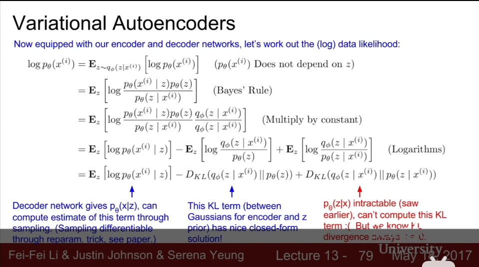
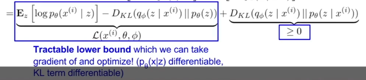
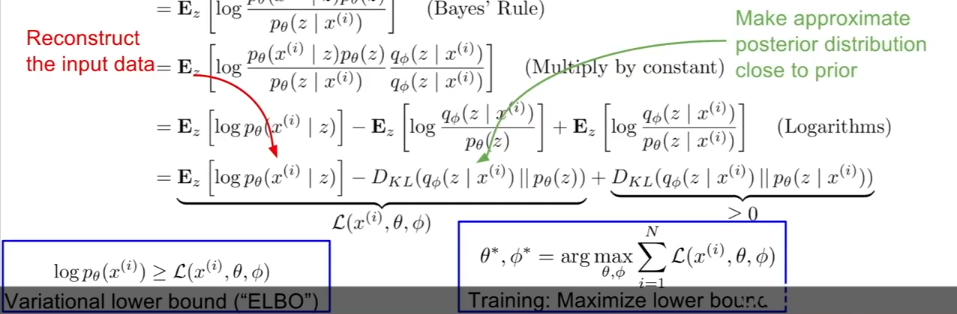
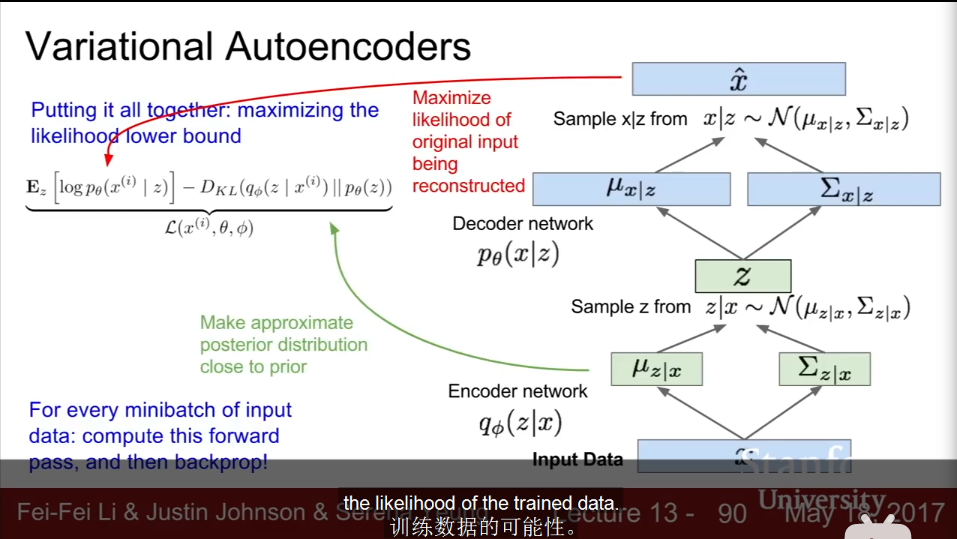
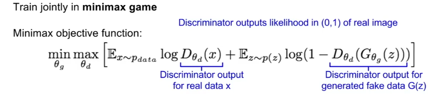

# generative models

## unsupervised learning
- just data, no labels(data is cheap)
- Learn some underlying hidden feature, rather than function mapping(supervised learning)
    > understand structure of visual world
- examples: clustering(K-means), dimensionality reduction(PCA), feature learning, density estimation.

## generative models
- comparision
    - discriminative(判别式): directly model $P(y|x)$, find decision boundary
    - generative
        - based on Bayes' rule $P(y|x)=\frac{P(xy)}{P(x)}$
        - get features $z$ that hides, find different $P(xy)$(each category has different model)
        - have more freedom for priori knowledge $P(x)$
    - common: maximize $P(y|x)$
- subset of unsupervised learning
- training data $p_{data}(x)$, generated samples from learned distribution $p_{model}(x)$
- training: like MLE, gradient ascent on likelihood function
- density(**likelihood**) estimation: core problem
    - explicit density: define and solve $p_{model}(x)$
        - tractable density/ approximate density
    - implicit density: learn model that samples from $p_{model}(x)$
        - Markov chain(GSN) / direct(GAN)
- application
    1. sample for artwork, super-resolution, colorization
    2. time-series data: simulation and planning(reinforcement learning)(?)
    3. inference of latent representations as general features

### pixelRNN and PixelCNN
- explicit-tractable- fully visible belief network
    - density function: chain rule: $p(x)=\prod_{i=1}^n p(x_i|x_1,\dots,x_{i-1})$, $p(x)$ is likelihood of image x, $p(x_i)$ is of i-th pixel value
    - using network to represent complex transformation $p(x_i)$
- define previous pixels
    - pixelRNN: generate pixels from corner, using RNN predict connected pixels
        - drawback: sequential generation is slow
    - pixelCNN: generate pixels from corner, using CNN predict context region
        - training: maximize $p(x)$, "labels" from input images(no extra labels needed)
        - drawback: faster but still slow (sequential generation)
- pros: explicit $p(x)$, good evaluation metric(directly come from input), good output.
- cons: slow

### Aside: probability and statistics
> - Bayes' Theorem: $P(A|B)=\frac{P(AB)}{P(B)}=\frac{P(B|A)P(A)}{P(B)}=\frac{P(B|A)P(A)}{P(B|A)P(A)+P(B|\sim A)P(\sim A)}$
>     - concepts
>         1. priori(先验): $P(A)$, indicate learning (priori assumption)
>         2. posteriori(后验): $P(A|B)$
>         3. likelihood(似然): $P(B|A)$
>         4. evidence(证据): $P(B)$
>     - make $P(A|B)=1$: let $P(\sim A)=0$
>     - if priori $P(A)$ is small, no matter likelihood $P(B|A)$, posteriori $P(A|B)$ is small
> - Probability: have model and params, guess data
> - Statistics: have data, guess model and params
>     - Frequentism: params of model is fixed, data is randomly sampled
>     - Bayesianism: data is fixed, params of model is variant. Make priori
> - parameter($\theta$) estimation (Statistics)
>     - probability function(概率函数): $P(x|\theta)$ where $\theta$ is fixed, $x$ is variant.
>     - likelihood function(似然函数): $P(x|\theta)$ where $x$ is fixed, $\theta$ is variant.
>     - maximum likelihood estimation(MLE最大似然估计): maximize likelihood function $f(x_0|\theta)$
>     - maximum a posteriori estimation(MAP最大后验概率估计): maximize $P(x_0|\theta)P(\theta)$
>         - multiply $P(\theta)$ is like regularization, **increase priori**.
>         - essentially maximize posterior $P(\theta|x_0)=\frac{P(x_0|\theta)P(\theta)}{P(x_0)}$ because evidence $P(x_0)$ is fixed.

### Variational Auto-Encoders(VAE变分自编码器)
- explicit-approximate (about likelihood function)
- encoder and decoder network: also named "recognition" / "inference" / "generation" network(point at hidden $z$)
- density function: $p_{\theta}(x)=\int p_{\theta}(z)p_{\theta}(x|z)dz$
    - $z$ is latent variable means previous pixels
    - $p_{\theta}(z)$ is simple Gaussian priori
    - $p_{\theta}(x|z)$ is complex: decoder neural network
    - cannot optimize directly, need derive and optimize lower bound on likelihood
- autoencoders
    - unsupervised approach for learning lower-dimensional feature
    - $x$ (input) -> *Encoder* -> $z$ (feature) -> *Decoder* -> $\hat{x}$ (reconstructed input data)
    - encoder/decoder: linear+sigmoid -> deep fully-connected -> ReLU CNN(upconv for decoder)
        - encoder: initialize supervised model: $z$ -> classifier -> $\hat{y}$ (predicted labels), with $y$ get loss to tune encoder.
        - drop decoder after training
    - $z$ is smaller than $x$(dimensionality reduction): capture features
    - training: features can be reconstructed. Auto means encode and decode and training(Use L2 loss)
- variational autoencoders
    - probabilistic spin on autoencoders, sample from model $p_{\theta^*}(z)\to p_{\theta^*}(x|z^{(i)})$, $*$ means true param
    - estimate $\theta^*$: choose $p(z)$, using neural network(decoder network) to represent complex $p(x|z)$.
    - training: learn model params to **maximize** $p_{\theta}(x)$
    - problem: integral is intractable(难解决的)
        - integral for every $z$
        - posteriori $p_{\theta}(z|x)=\frac{p_{\theta}(x|z)p_{\theta}(z)}{p_{\theta}(x)}$ where $p_{\theta}(x)$ is intractable
    - solution: use encoder network $q_{\phi}(z|x)$ to approximate $p_{\theta}(z|x)$ get a lower bound to optimize.
    - networks are probabilistic:
        - encoder: $z|x$, sample $z$, network $q_{\phi}$, output mean($\mu$), (diagonal) covariance($\sum$)
        - decoder: $x|z$, sample $x|z$, $p_{\theta}$
        - network produce distribution(like $z|x\sim \mathcal{N}(\mu_{z|x},\sum_{z|x})$), then sample from it
    - data likelihood derivation:
        - Kullback-Leibler Divergence: $D_{KL}$, how close these terms are.
        - 
        - 
        - 
    - computation graph: 
    - result
        - diagonal prior on $z$ means independent latent variables
        - dimensions of $z$ means variation factors
- pros
    1. principled approach
    2. allow $q_{\phi}(z|x)$ and useful for other tasks
- cons
    1. evaluation of maximize lower bound is worse than PixelRNN/ PixelCNN
    2. samples blurrier and lower quality than SOTA: GAN

### Generative Adversarial Networks(GAN)
- implicit-direct: without explicit density function, just sample
    - input: random noise(simple distribution) -> generator network(transformation, NN decoder) -> fake images(complex distribution) with real images -> discriminator network -> loss
    - because no direct way to sample complex distribution
- learn from training distribution from 2-player game
    - generator network: fool by generating
    - discriminator network: distinguish between real and fake
- minimax game
    - discriminator: maximize object $D(x)\to 1,D(G(z))\to 0$
    - generator: minimize object $D(G(z))\to 1$
    - 
    - training: gradient ascent($\max$) on discriminator(whole expression has param $\theta_d$), gradient descent($\min$) on generator(last term has $\theta_g$) 
        - problem: $\min$ term: gradient signal dominated when generator is good
        - solution: $\max$ term dominated when generator is bad, use it when discriminator is good
        - aside: jointly training is challenging / unstable, choosing objectives with better loss landscape is helpful.
- struct
    - train discriminator a little bit($k$ times) then generator
    - $k=1$ or $k>1$ is stable
    - after training only use generator to generate
    - convolutional architectures have better performance
    - interpolate between random points: tune
    - vector math: feature compose
- application: target domain transfer, text to image synthesis...
- pros: nice samples
- cons
    - tricker and unstable(not a simple loss function)
    - can't solve inference queries $p(x),p(z|x)$
