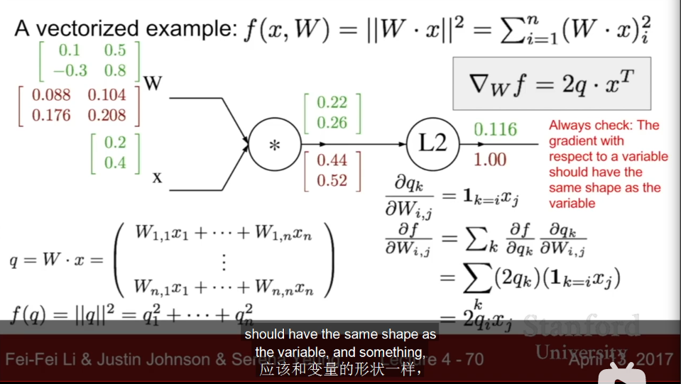
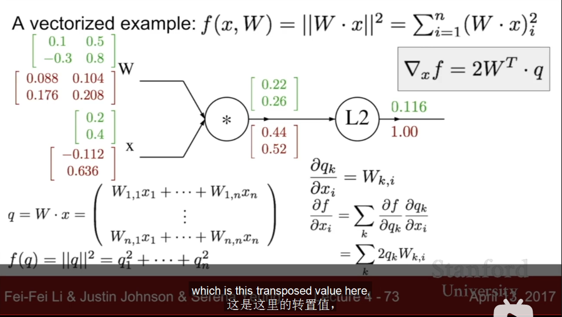

# introduction to neutral networks

## gradient
> in machine learning we thought training data is fixed, so only need to compute gradient of parameters(weights and bias) (but gradient of x is useful when visualizing and interpreting networks)

>  gradient $\nabla f=[\frac{\partial f}{\partial x},\frac{\partial f}{\partial y}]$ is the vector of partial derivatives  
> For simplicity, gradient on $x$ stands for partial dirivative on $x$

- computational graphs: $W,x\to score, W\to R(W)$ with hinge loss $\to L$. Network is big, so impractical to write gradient formula by hand for all parameters.
- upstream: from source to loss function through forward propagation.
- API
    - forward propagation: save all intermediate values for backpropagation.
    - backpropagation: chain rule(simple in computing, only add and mul) get gradient, compute local gradient at each node.
    > coding: omits df prefix, using `dx` instead of `dfdx`
    - real-valued circuit diagram: **lines mean variables**
        - above lines are computed values, below lines are final gradients need to multiply previous gradient(intermediate), start from 1.
        - computation is independent, don't need to know the whole.
> sigmoid function: $\sigma (x)=\frac{1}{1+e^{-x}}$, $\frac{d\sigma (x)}{dx}=(1-\sigma (x))\sigma (x)$. Packing up can be easy in gradient computing.
- patterns in backward flow:
    - add gate: distributor
    - max: router(one is zero, the other is full gradient value.)
    - mul: switcher
    - add branch(1 split to 2): sum up all branches(hint: reuse the same expression) $\frac{\partial f}{\partial x}=\sum_i \frac{\partial f}{\partial q_i}\frac{\partial q_i}{\partial x}$
- expand number to vectors: Jacobian matrix(each row means all variables deriviation of a function)
    - 
    - 
    > indicating function: $1_{i=k}$  
    > L2 norm: square of model of a vector
    - check: gradient w.r.t. a variable should have same shape of same variable.
- implementation: moudlarization each node/gate(example: Caffe layers framework)

## neutral network
- from linear score function to non-linear(e.g. max function of linear function), multiple stages of hierarchical computation. Helpful in matching more models.
> $f(x)=W_2max(0,W_1)$
- deep: add more layers
- simlar to biological neurons, but loose analogy.
- activate function:
    - sigmoid $\sigma(x)=\frac{1}{1+e^{-x}}$
    - tanh
    - ReLU $max(0,x)$
    - Leaky ReLU $max(0.1x,x)$
    - maxout $max(w_1^Tx+b_1,x_2^Tx+b_2)$
    - ELU $x(x\ge 0);\alpha(e^x-1)(x\lt 0)$
- 2-layer neutal net(fully-connected layers, including output layer, except from input layer) = 1-hidden-layer neural net
